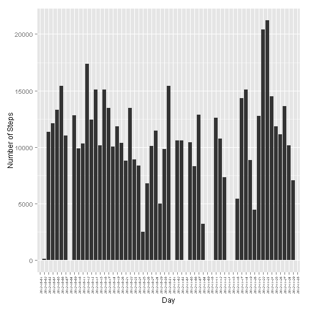
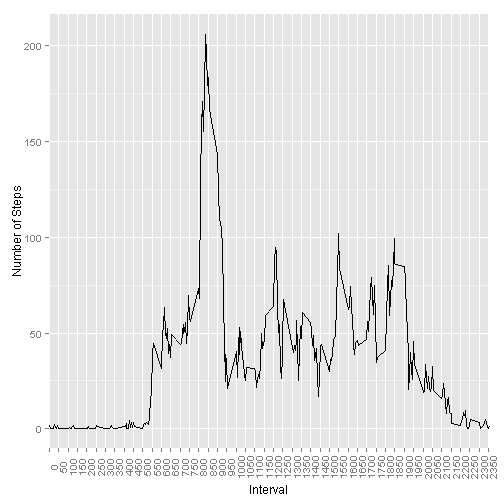
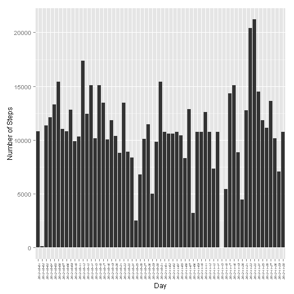
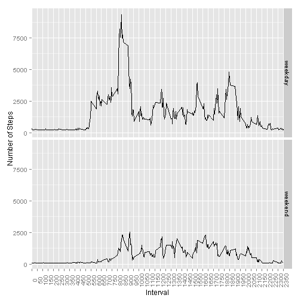

Peer Assessment 1
========================================================

This are my answers to the questions posed in peer assessment 1.  
Loading of data


```r
temp = tempfile()
download.file("http://d396qusza40orc.cloudfront.net/repdata%2Fdata%2Factivity.zip", 
    temp)
data = read.csv(unz(temp, "activity.csv"), colClasses = c("numeric", "Date", 
    "numeric"))
```


The mean number of steps made each day is:

```r
mean = tapply(data$steps, data$date, mean, na.rm = T)
print(mean)
```

```
## 2012-10-01 2012-10-02 2012-10-03 2012-10-04 2012-10-05 2012-10-06 
##        NaN     0.4375    39.4167    42.0694    46.1597    53.5417 
## 2012-10-07 2012-10-08 2012-10-09 2012-10-10 2012-10-11 2012-10-12 
##    38.2465        NaN    44.4826    34.3750    35.7778    60.3542 
## 2012-10-13 2012-10-14 2012-10-15 2012-10-16 2012-10-17 2012-10-18 
##    43.1458    52.4236    35.2049    52.3750    46.7083    34.9167 
## 2012-10-19 2012-10-20 2012-10-21 2012-10-22 2012-10-23 2012-10-24 
##    41.0729    36.0938    30.6285    46.7361    30.9653    29.0104 
## 2012-10-25 2012-10-26 2012-10-27 2012-10-28 2012-10-29 2012-10-30 
##     8.6528    23.5347    35.1354    39.7847    17.4236    34.0938 
## 2012-10-31 2012-11-01 2012-11-02 2012-11-03 2012-11-04 2012-11-05 
##    53.5208        NaN    36.8056    36.7049        NaN    36.2465 
## 2012-11-06 2012-11-07 2012-11-08 2012-11-09 2012-11-10 2012-11-11 
##    28.9375    44.7326    11.1771        NaN        NaN    43.7778 
## 2012-11-12 2012-11-13 2012-11-14 2012-11-15 2012-11-16 2012-11-17 
##    37.3785    25.4722        NaN     0.1424    18.8924    49.7882 
## 2012-11-18 2012-11-19 2012-11-20 2012-11-21 2012-11-22 2012-11-23 
##    52.4653    30.6979    15.5278    44.3993    70.9271    73.5903 
## 2012-11-24 2012-11-25 2012-11-26 2012-11-27 2012-11-28 2012-11-29 
##    50.2708    41.0903    38.7569    47.3819    35.3576    24.4688 
## 2012-11-30 
##        NaN
```


The median number of steps made each day is:

```r
median = tapply(data$steps, data$date, median, na.rm = T)
print(median)
```

```
## 2012-10-01 2012-10-02 2012-10-03 2012-10-04 2012-10-05 2012-10-06 
##         NA          0          0          0          0          0 
## 2012-10-07 2012-10-08 2012-10-09 2012-10-10 2012-10-11 2012-10-12 
##          0         NA          0          0          0          0 
## 2012-10-13 2012-10-14 2012-10-15 2012-10-16 2012-10-17 2012-10-18 
##          0          0          0          0          0          0 
## 2012-10-19 2012-10-20 2012-10-21 2012-10-22 2012-10-23 2012-10-24 
##          0          0          0          0          0          0 
## 2012-10-25 2012-10-26 2012-10-27 2012-10-28 2012-10-29 2012-10-30 
##          0          0          0          0          0          0 
## 2012-10-31 2012-11-01 2012-11-02 2012-11-03 2012-11-04 2012-11-05 
##          0         NA          0          0         NA          0 
## 2012-11-06 2012-11-07 2012-11-08 2012-11-09 2012-11-10 2012-11-11 
##          0          0          0         NA         NA          0 
## 2012-11-12 2012-11-13 2012-11-14 2012-11-15 2012-11-16 2012-11-17 
##          0          0         NA          0          0          0 
## 2012-11-18 2012-11-19 2012-11-20 2012-11-21 2012-11-22 2012-11-23 
##          0          0          0          0          0          0 
## 2012-11-24 2012-11-25 2012-11-26 2012-11-27 2012-11-28 2012-11-29 
##          0          0          0          0          0          0 
## 2012-11-30 
##         NA
```


This histogram shows the total amount of steps made each day:

```r
library(ggplot2)
x = tapply(data$steps, data$date, sum, na.rm = T)
x = as.data.frame(x)
g = ggplot(x, aes(rownames(x), x))
a = g + geom_bar(stat = "identity") + theme(axis.text.x = element_text(angle = 90, 
    vjust = 0.5, size = 5)) + labs(x = "Day") + labs(y = "Number of Steps")
print(a)
```

 


The average daily pattern of steps is reflected in the next figure:

```r
x = tapply(data$steps, data$interval, mean, na.rm = T)
x1 = data.frame(as.numeric(rownames(x)), x)
g = ggplot(x1, aes(x1[, 1], x1[, 2]))
a = g + geom_line(stat = "identity") + theme(axis.text.x = element_text(angle = 90)) + 
    labs(x = "Interval") + labs(y = "Number of Steps") + scale_x_discrete(breaks = seq(0, 
    2355, 50))
print(a)
```

 


 


```r
maximum = x1[x1[, 2] == max(x1[, 2]), 1]
```


With the maximum number of steps achieved at interval 835:


```r
miss = nrow(data) - sum(complete.cases(data))
```


Data has 2304 missing values, and missing values have been replaced by the average step number for each month in a new dataset. The following histogram shows the total number of steps taken each day after replacing the missing values.


```r
newdata = data.frame(data)
newdata$fecha = as.POSIXlt(data$date)
newdata[(!complete.cases(newdata[, 1]) & newdata$fecha$mon == 9), 1] = mean(newdata[newdata$fecha$mon == 
    9, 1], na.rm = T)
newdata[(!complete.cases(newdata[, 1]) & newdata$fecha$mon == 10), 1] = mean(newdata[newdata$fecha$mon == 
    10, 1], na.rm = T)
y = tapply(newdata$steps, newdata$date, sum, na.rm = T)
y = as.data.frame(y)
g = ggplot(y, aes(rownames(y), y))
a = g + geom_bar(stat = "identity") + theme(axis.text.x = element_text(angle = 90, 
    vjust = 0.5, size = 5)) + labs(x = "Day") + labs(y = "Number of Steps")
print(a)
```

 

```r
mean = tapply(newdata$steps, newdata$date, mean, na.rm = T)
median = tapply(newdata$steps, newdata$date, median, na.rm = T)
```


The mean of data has changed after the replacement.


```r
print(mean)
```

```
## 2012-10-01 2012-10-02 2012-10-03 2012-10-04 2012-10-05 2012-10-06 
##    37.4582     0.4375    39.4167    42.0694    46.1597    53.5417 
## 2012-10-07 2012-10-08 2012-10-09 2012-10-10 2012-10-11 2012-10-12 
##    38.2465    37.4582    44.4826    34.3750    35.7778    60.3542 
## 2012-10-13 2012-10-14 2012-10-15 2012-10-16 2012-10-17 2012-10-18 
##    43.1458    52.4236    35.2049    52.3750    46.7083    34.9167 
## 2012-10-19 2012-10-20 2012-10-21 2012-10-22 2012-10-23 2012-10-24 
##    41.0729    36.0938    30.6285    46.7361    30.9653    29.0104 
## 2012-10-25 2012-10-26 2012-10-27 2012-10-28 2012-10-29 2012-10-30 
##     8.6528    23.5347    35.1354    39.7847    17.4236    34.0938 
## 2012-10-31 2012-11-01 2012-11-02 2012-11-03 2012-11-04 2012-11-05 
##    53.5208    37.2912    36.8056    36.7049    37.2912    36.2465 
## 2012-11-06 2012-11-07 2012-11-08 2012-11-09 2012-11-10 2012-11-11 
##    28.9375    44.7326    11.1771    37.2912    37.2912    43.7778 
## 2012-11-12 2012-11-13 2012-11-14 2012-11-15 2012-11-16 2012-11-17 
##    37.3785    25.4722    37.2912     0.1424    18.8924    49.7882 
## 2012-11-18 2012-11-19 2012-11-20 2012-11-21 2012-11-22 2012-11-23 
##    52.4653    30.6979    15.5278    44.3993    70.9271    73.5903 
## 2012-11-24 2012-11-25 2012-11-26 2012-11-27 2012-11-28 2012-11-29 
##    50.2708    41.0903    38.7569    47.3819    35.3576    24.4688 
## 2012-11-30 
##    37.2912
```

The median does so in days where all values were NA's

```r
print(median)
```

```
## 2012-10-01 2012-10-02 2012-10-03 2012-10-04 2012-10-05 2012-10-06 
##      37.46       0.00       0.00       0.00       0.00       0.00 
## 2012-10-07 2012-10-08 2012-10-09 2012-10-10 2012-10-11 2012-10-12 
##       0.00      37.46       0.00       0.00       0.00       0.00 
## 2012-10-13 2012-10-14 2012-10-15 2012-10-16 2012-10-17 2012-10-18 
##       0.00       0.00       0.00       0.00       0.00       0.00 
## 2012-10-19 2012-10-20 2012-10-21 2012-10-22 2012-10-23 2012-10-24 
##       0.00       0.00       0.00       0.00       0.00       0.00 
## 2012-10-25 2012-10-26 2012-10-27 2012-10-28 2012-10-29 2012-10-30 
##       0.00       0.00       0.00       0.00       0.00       0.00 
## 2012-10-31 2012-11-01 2012-11-02 2012-11-03 2012-11-04 2012-11-05 
##       0.00      37.29       0.00       0.00      37.29       0.00 
## 2012-11-06 2012-11-07 2012-11-08 2012-11-09 2012-11-10 2012-11-11 
##       0.00       0.00       0.00      37.29      37.29       0.00 
## 2012-11-12 2012-11-13 2012-11-14 2012-11-15 2012-11-16 2012-11-17 
##       0.00       0.00      37.29       0.00       0.00       0.00 
## 2012-11-18 2012-11-19 2012-11-20 2012-11-21 2012-11-22 2012-11-23 
##       0.00       0.00       0.00       0.00       0.00       0.00 
## 2012-11-24 2012-11-25 2012-11-26 2012-11-27 2012-11-28 2012-11-29 
##       0.00       0.00       0.00       0.00       0.00       0.00 
## 2012-11-30 
##      37.29
```


The impact of this replacement on daily number of steps is that of rising the value for those days with NA's, particularly those days with no data at all.

Exploring the differences between weekdays and weekends, the following plot:


```r
a = c("sábado", "domingo")
for (i in 1:length(newdata$fecha)) {
    if (weekdays(newdata$fecha[i]) %in% a) {
        newdata$week[i] = "weekend"
    } else {
        newdata$week[i] = "weekday"
    }
}
m = aggregate(steps ~ interval + week, FUN = sum, data = newdata)
g = ggplot(m, aes(interval, steps))
a = g + geom_line(stat = "identity") + theme(axis.text.x = element_text(angle = 90)) + 
    labs(x = "Interval") + labs(y = "Number of Steps") + scale_x_discrete(breaks = seq(0, 
    2355, 50)) + facet_grid(week ~ .)
print(a)
```

 


clearly shows that weekends are "lazier" than weekdays.
